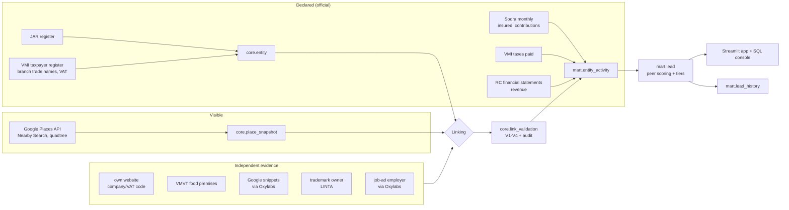

# shadowleads: busy in public, quiet on paper

A pipeline that gives a VMI (State Tax Inspectorate) analyst a **prioritised, explainable
lead list** of Vilnius businesses that look busy on Google but declare little to the state. It
covers three categories: **hairdressers & beauty salons**, **bars, pubs & night clubs**, and
**car wash & repair**.

> Leads, not accusations. Every lead shows which Google listing and which official records it is
> built from, how the two were linked, how sure we are of that link, and why it scored as it did.
> Honest businesses are protected by design (see [Trust](#trust-the-cost-of-a-wrong-lead)).

```bash
docker compose up        # http://localhost:8501
```
This rebuilds the warehouse from the committed example of a real run (`examples/2026-09`) and
serves the analyst app. It needs no keys and makes no calls to data sources. A live run is
opt-in, because it spends API quota: `SHADOWLEADS_MODE=live docker compose up`, with keys in `.env`
(see [.env.example](.env.example)).

## Results of the committed run (September 2026 snapshot)

| | Hair & beauty | Bars & clubs | Car wash & repair |
|---|---|---|---|
| Google places in scope | 1,665 | 361 | 1,347 |
| Linked to a legal entity | 17% | 49% | 42% |
| ... share of all Google reviews covered | 41% | 68% | 68% |
| Leads / watchlist | 10 / 9 | 1 / 9 | 4 / 17 |

- 4,017 places swept, 1,025 linked, of which 799 links are trusted enough to produce a lead.
- Two manual audits of stratified links:
  - **Audit 1:** 48 links, 75% correct. Its findings led to rule fixes.
  - **Audit 2:** 54 new links after the fixes, 84% correct, and 85% among links trusted for
    leads. Exact-name, website-code and VMVT links were 100% correct; address-only links 67%.
  - Wrong links named in the notes are corrected through analyst overrides.
- Independent evidence agrees with name-based links in 93% of the cases where both exist; for
  address-only links the figure is 64%, so those never produce a lead unless confirmed.
- External calls: 1,115 Google calls (within the free tier in each month), 749 Oxylabs results
  (300 of them spent on the busiest still-unlinked places), and a few thousand rate-limited requests
  to public registers and business websites.

## How it works



### Data sources

| Source | What we take | Grain | Freshness |
|---|---|---|---|
| Google Places API (New), Nearby Search | name, address, coordinates, primary type, rating, **review count**, opening hours, price range, website | place × month | live |
| Registrų centras JAR (bulk CSV) | company code, legal name, legal form, registered address, status | entity | daily |
| VMI taxpayer register (data.gov.lt) | **branch trade names** in Vilnius, activity codes, VAT registration | entity × branch | daily |
| VMI taxes paid (data.gov.lt) | taxes paid per calendar year (current year to date) | entity × year | monthly |
| Sodra (atvira.sodra.lt bulk ZIP) | insured persons, contributions, average wage, activity code | entity × month | monthly, ~1 month lag |
| RC financial statements (data.gov.lt) | sales revenue, labelled with its fiscal year | entity × FY | lags (FY2024 mostly) |
| VMVT food-business register | company code + trade name + **premises address** (bars) | premises | live |
| Businesses' own websites | self-declared company / VAT code (each site's `robots.txt` crawl rules are respected) | place | live |
| Oxylabs Web Scraper API (Google Search) | company codes and job-ad employers quoted in search snippets | place | live |
| State Patent Bureau (search.linta.lt) | trademark owner of the brand | brand | live |

*Freshness* is how often the **publisher** updates the data (the JAR file is rebuilt daily, VMI
taxes monthly). Each run simply takes the latest version available on the run date; no daily
history is collected. `robots.txt` is a file each website publishes at its root
(`https://example.lt/robots.txt`) telling automated crawlers which pages they may fetch; the website
scanner reads it on every business site and skips disallowed pages.

Rejected sources: rekvizitai.lt and LIS licence pages (terms forbid copying), .lt WHOIS (the
registrant is hidden), Google Popular Times (relative to each venue's own peak, so it doesn't show
visitor volume, and it has no official API).

### Linking a Google place to a company code
1. **Exact full name** against JAR legal names and VMI branch trade names. Google "Bromas Baras"
   matches VMI branch "Bromas". This needs corroboration: an activity code that fits the category, or
   the same building as the registered address (flats are ignored, so "60A-245" matches "60A").
2. **Core name** (generic words like "baras" or "kirpykla" removed): only with address agreement,
   or a rare name plus an activity code that fits.
3. **Address only**: exactly one consistent company registered at a non-multi-tenant Vilnius
   address.
4. **Fallbacks** for everything else: codes on the business's own website, VMVT premises,
   search snippets that name the business, trademark owners, job-ad employers.

Every candidate, its evidence and the decision are stored (`core.match_candidate`,
`core.place_entity_link`), versioned per month.

**Validation** happens after linking and never creates a link; it decides how far each link can be
trusted (`core.link_validation`, `usable` flag). Automatic checks run on every link, before any
manual audit:
- **Plausibility:** the company is active, its activity codes fit the category, its registered
  address is in Vilnius when the link used an address, it is not linked to more than 3 places
  across categories and websites, and its website is not shared by 3+ addresses (franchisor site).
- **Cross-check:** evidence that did not create the link (website code, VMVT premises, search
  snippets) confirms it or names another company. Conflicts are never usable.

The **analyst audit** covers what automation cannot decide (page not reached, no code shown, site
rendered by JavaScript): footer or privacy policy read by hand, phone number matched via a company
directory, premises licence checked. Verdicts that should hold go to `labels/link_overrides.csv`,
applied on every run. See [labels/README.md](labels/README.md) for the four stages and which part is
automated; `shadowleads audit-sample` draws a new audit sample.

Trademark and job-ad evidence identify the company behind a *brand*. For franchises (Švaros broliai)
and groups that run one company per venue (Grill London), that is not the operator, so these sources
never confirm a link on their own.

### Scoring: "declares far less than peers who look equally busy"
- **Visible activity:** the **lifetime** Google review count across the company's Vilnius places,
  divided by its years active. Years active = time since the company's registration date in the
  JAR register, at least 1 and at most 7 years. Most Google reviews are recent, so dividing an old
  company's lifetime count by its full age would understate its current activity. The result is
  an average, not a count of reviews in a given year: the Places API returns only the lifetime
  total.
- **Busy:** reviews per active year in the category's top 40% of linked companies, and at least 30
  reviews in total. A very low or very high rating (≤3.5 or ≥4.8) needs the top 20% and 75
  reviews: such ratings attract disproportionate reviews, so they need more evidence rather than
  adjusted counts. A lifetime total is deliberately not used as a busy test: it lets old, quiet
  companies pass and blocks young, busy ones.
- **Peers:** same category × review-volume quintile × legal form (MB/IĮ owners pay part of their
  taxes personally). Medians come from single-site, activity-consistent peers only, so national
  chains don't inflate them.
- **Score:** weighted `ln(peer median / declared)` gaps:
  - VMI taxes paid (0.5, the main dimension);
  - Sodra contributions, or headcount when Sodra suppresses contributions (0.3);
  - latest filed revenue, with its fiscal year shown (0.2).
- **Secondary ratios:** reviews per €1k of taxes and per €1k of revenue, and insured persons per 100
  reviews. Near-zero values are clamped to a floor so the ratios can't explode.
- **Corroborating signals** (independent of the score, at least one is needed for a lead):
  - **Near-zero declared figures:** VMI taxes under €500, or revenue under €5,000, for the year.
  - **Staffing floor:** the company's busiest place is open more hours a week than its declared
    staff could cover. Weekly opening hours ÷ 40 (one full-time week) is the minimum number of
    full-time people needed to have one person on site whenever it is open. The signal fires when
    that minimum exceeds the company's average insured people over the last 12 months **plus one**.
    The extra person allows for the owner or a manager working without being insured. Example: open
    84 h/week → 2.1 people needed; a company with 1 insured person on average (1 + 1 = 2) triggers
    it. Not applied to MB/IĮ (owners work without being employees) or to self-service car washes.
  - **VAT gap:** the company is not VAT-registered, although its peers' median revenue is above the
    €45,000 VAT registration threshold.

### Trust: the cost of a wrong lead
**Leads** (tier A) are capped at 20 per month (the analyst's capacity) and require *all* of:
- a usable link;
- a visibly busy business;
- peers paying at least 3× more tax;
- an entity at least 12 months old, with a VMI record (missing data is never treated as zero;
  companies whose 2025 tax row is not published yet are scored on their 2024 taxes, shown as
  `taxes_year` and stated in the lead explanation);
- at least one corroborating signal, or two if the rating is **extreme**: a review-weighted
  average of 3.5 or lower, or 4.8 or higher. Very unhappy or very enthusiastic customers leave
  reviews more often than average ones, so such review counts overstate how busy a place is and
  need extra evidence.

Every other entity gets a tier and a stated `hold_reason`. Each lead also shows the legitimate
explanations typical of its category (chair rental, family labour, group staffing). 18 data-quality
assertions run on every run, and an `error` blocks the export.

## Using it

**Analyst app** (`docker compose up` → http://localhost:8501):
- **Leads:** filter by tier and category, download CSV. Each lead opens a plain-language
  explanation, its Google listings, the official records (VMI per year, Sodra per month, revenue),
  the link evidence, the peer comparison, and deep links to the company's records at Registrų
  centras, VMI, Sodra and data.gov.lt.
- **Coverage & map** (filter by category, link status and tier; hover a place for its company),
  **Month over month** and **Data quality**.
- A **snapshot** selector in the sidebar switches every page between monthly runs.
- **SQL console:** read-only SQL over the warehouse, with saved example questions:
  ```sql
  -- which categories have the highest share of flagged businesses?
  SELECT main_category, count(*) AS scored,
         count(*) FILTER (WHERE tier IN ('A_priority','B_watchlist')) AS flagged,
         round(100.0 * flagged / scored, 1) AS pct_flagged
  FROM mart.lead WHERE tier <> 'D_insufficient_evidence' GROUP BY ALL ORDER BY pct_flagged DESC;
  ```
  The DuckDB file (`data/warehouse.duckdb`) also opens in any SQL client.

**Running it:**
- `shadowleads run --run-month 2026-10` runs the whole chain:
  1. ingest
  2. link
  3. fallbacks
  4. validate
  5. score
  6. DQ checks
  7. export
- Each stage is idempotent and can be run on its own (`shadowleads --help`).
- Each run is stored as a monthly snapshot next to earlier ones. **Month over month** in the app
  (and `mart.lead_history`) shows new, dropped and re-tiered leads and why they changed: re-linked,
  declared figures changed, or Google activity changed.
- Every Google and Oxylabs response is cached, and a call ledger enforces monthly budgets
  (`SHADOWLEADS_GOOGLE_BUDGET`, default 900).
- **Saved SQL queries** are application state, kept in a small SQLite database
  (`state/app_state.sqlite`, its own Docker volume), separate from the code and the read-only
  warehouse.

**Local development:**
```bash
uv sync
uv run ruff check . && uv run pyrefly check && uv run pytest
uv run shadowleads run          # needs GOOGLE_MAPS_API_KEY (+ OXYLABS_* optional) in .env
uv run streamlit run app/streamlit_app.py
```

**Committed example:** `examples/<month>/` holds the tables of a real run as Parquet:
- every Google place of the snapshot and how each was (or was not) linked;
- every **scored** company: all four tiers, not only leads and the watchlist;
- those companies' official records (VMI taxes, Sodra months, revenue, VMVT premises, VMI branches).

It leaves out the national registers themselves (230k companies, 3M Sodra rows) and the raw Google
API payloads. Company names and codes are public register data and are kept as they are. Docker's
demo mode loads exactly this into its own warehouse, which is why the SQL console there also shows
companies that were scored but not flagged.

## Repository layout
```
src/shadowleads/
  sources/   google_places, official (JAR/Sodra/VMI/RC), vmvt, websites, oxylabs, trademarks, spinta
  linking/   normalize, matcher (primary rules), fallback, brand_evidence, resolve
  sql/       core_*, mart_*, dq_checks.sql  (stg -> core -> mart)
  cli.py     stages + `run` / `auto` / `demo`
app/         Streamlit analyst app
examples/    real run (Parquet tables for the offline demo + leads.csv)
labels/      analyst audit labels and link overrides (inputs)
tests/       Hypothesis property tests, parser/rule regressions, app smoke tests
```

## Where it can fail

**Wrong matches** (2 audits; 84% of audited links correct, 85% among links trusted for leads):
- **Same brand, different operator:** a brewery owns the bar's brand and trademark, a franchisor
  owns the website, or a group runs one company per venue. Brand-level evidence never links on its
  own, but the audit still found a brewery linked to a bar (now rejected by an override).
- **One site, several companies:** an e-shop company and a salon company share a website (Synth:
  MB Šilaika runs the shop, MB Du Vilkai the salon). Privacy-policy codes now win.
- **Address-only and core-name links** are the weakest (67% and 75% correct); address-only links
  never produce a lead unless independent evidence confirms them.
- **Erroneous Google listings** (an address as the name, a non-existent business) were linked to
  whoever was registered there; listings named only by an address are now out of scope.
- **Not found at all:** natural persons, companies registered elsewhere, salons with only a
  Facebook or Treatwell page (17% of hair/beauty places linked). This is a recall problem, and it
  biases leads toward businesses with websites.

**False positives** (legitimate reasons a busy business declares little):
- **Hair and beauty:** chairs rented to self-employed specialists, who pay their own taxes, so the
  company looks empty. 10 of the 15 leads are salons, so this is the main risk.
- **Group staffing:** staff employed and taxes paid by a sister company.
- **Owner-operated MB/IĮ:** the owner's taxes are paid personally (mitigated by separate peers).
- **Stale or skewed reviews:** reviews from a previous operator, bought reviews, tourist-heavy
  venues; the lifetime count cannot be tied to the tax year.
- **Stale declared data:** revenue is mostly FY2024; a company's 2025 taxes may be unpublished
  (then 2024 is used and shown).
- **Ranking by ratio, not euros:** the score is a log ratio, so a salon declaring €4 against a
  €1.3k peer median ranks above a bar declaring €1.2k against €66k. Ranking leads by the euro gap
  would put the larger amounts first.

**Not yet proven:** link precision is measured, lead precision is not. Inspection outcomes
(violation found / clean) are the labels that would measure it; until then each lead is a
documented hypothesis with its explanation and sources, not a verdict.

## Towards production

**Scalability (3 categories in Vilnius → every business in Lithuania)**
- The official registers already cover the whole country (the largest table is 3.35M Sodra rows; the
  warehouse is ~200 MB), so a single machine is enough. Google coverage is the part that scales
  with area: Vilnius for 3 categories took ~1,100 calls, and all of Lithuania for all categories is
  plausibly 50–100× that.
- **Incremental re-linking:** today every run re-matches all places from scratch, which is fine for
  3,400 places. At national scale, carry last month's link forward and re-match only places whose
  inputs changed. A place is re-linked when:
  - it is new on Google;
  - its Google name, address or website changed, or the listing closed or reopened;
  - its linked company changed status (liquidation, bankruptcy, deregistration), so the venue may
    have a new operator;
  - new evidence appeared (a VMVT premises registration, a company or VAT code on its website, a
    new VMI branch, a new trademark owner);
  - an analyst override was added or changed;
  - a matching rule changed (then everything is re-run once).
- **Storage:** keep DuckDB as the compute engine, but write each monthly snapshot as Parquet /
  Iceberg tables partitioned by `run_month` on object storage. That gives cheap long history, schema
  evolution and time travel.
- **Where DuckDB falls short** (and what would replace it):
  - one writer process at a time, which also blocks readers while it writes: fine for a monthly
    batch with a read-only app, not for analysts recording decisions;
  - no users, roles or permissions: access is whoever can read the file;
  - no server, so remote clients and BI tools need a copy of the file;
  - history grows in one file, with no time travel or cheap tiered storage.

  Replacements: analyst decisions and app state in **Postgres** (OLTP, multi-user, permissions,
  audit trail). Monthly snapshots as **Parquet / Iceberg** tables on object storage (cheap history,
  time travel, schema evolution), queried by DuckDB, Trino or Athena. Hosted options such as
  MotherDuck, or DuckLake (DuckDB's lakehouse format with a shared catalog), keep the DuckDB engine
  with multi-user access.
- **Orchestration:** a monthly cron job on any Linux VM with Docker is enough to start; move to an
  orchestrator (Dagster, Airflow, Prefect) when per-step retries, backfills and alerting are needed.
- **Transformations:** the SQL models (`sql/core_*`, `sql/mart_*`) would move to dbt or SQLMesh for
  dependency ordering, incremental builds, tests and lineage documentation. Extraction stays in
  Python.
- **Dimensional model:** the `core` layer would become a star schema:
  - dimensions `dim_company` (with change history), `dim_place`, `dim_month`, `dim_category`;
  - facts per grain: company × month (Sodra), company × year (taxes, revenue), place × month
    (reviews, rating), and a place-company link bridge per month.

  What it buys: one clear grain per table, consistent joins for every analyst query, BI tools work
  out of the box, and history handled in one place instead of in each mart.
- **Slowly changing dimensions (type 2):** company status, address, name, legal form and VAT
  registration are kept with valid-from / valid-to dates. The JAR file only holds the current
  state, so history is built by comparing monthly snapshots. This also shows operator changes
  (PERONAS: operator in bankruptcy, bar still busy).

**Accuracy (matching and scoring)**
- **A trained matcher is realistic.** A useful model needs a few hundred to a couple of thousand
  labelled place → company pairs across methods, not hundreds of thousands; active learning (label
  the pairs the model is least sure about) reduces it further. Training takes seconds on a laptop.
  Plan:
  1. Analysts link the ~1,200 Vilnius places that currently have no candidate, plus a sample of
     existing links (a few weeks of work), recording the method as in the audits.
  2. Train on the stored candidate features (name similarity, address agreement, activity fit,
     evidence sources).
  3. Measure precision per method on a held-out audit sample before letting the model link on its
     own.

  Given the tax at stake, a few analyst-weeks is a small cost. The labels also show which new
  evidence sources are worth adding, because a model cannot link places that have no candidate.
- **Supervised calibration, ongoing:** inspection outcomes (violation found / clean) become labels
  that re-weight the score's dimensions and signals, and the review propensity per category, as the
  dataset grows.
- **Analyst decisions in the app, not CSV files:** today `labels/link_overrides.csv` holds analyst
  decisions. In production the app would let an analyst:
  - propose a link, a rejection or a lead disposition (inspected / clean / violation), with
    evidence;
  - have a second analyst approve it.

  Decisions go to a Postgres table (who, when, evidence, status) and are applied on every run, as
  the CSV is now. That is the "several writers" case DuckDB is not built for.
- **More matching evidence:** JAR's management-body data (`JAR_VALDYMAS.csv`) could link companies
  that share a director (group companies, franchise operators). The beneficial-owners register is not
  freely open.
- **Data VMI already holds:** i.EKA cash-register receipts, i.SAF invoices, employment contracts
  per premises, business-licence premises, and individual-activity declarations and business
  certificates by activity code. These are the primary sources for a production system: linking
  becomes exact, visible activity can be calibrated against real turnover, and the
  self-employed-hairdresser blind spot closes.

**Freshness (sources change at different rates)**
- A monthly cadence for everything: registers and declarations change slowly, and daily updates
  would add cost without changing a monthly lead list.
- **Financial statements (FY2025 revenue):** companies filed FY2025 statements by mid-2026, but the
  open export was last refreshed in March 2026 and covers ~3% of companies. The rest are available
  only per company from Registrų centras, as documents ordered through its e-services, not as open
  data. For the ~860 linked companies they could be fetched directly, turning the revenue
  dimension from FY2024 into FY2025; until then each run picks up FY2025 rows as they appear in
  open data.
  Only companies in activity quintiles 3–5 need them: the busy cutoff (top 40% per year) never
  reaches quintiles 1–2, so those companies are never leads and never peers of a busy company
  (peers share the quintile; the category-wide fallback for groups with too few peers was not
  needed for any busy company). Skipping quintiles 1–2 cuts these per-company lookups by about 40%
  without changing any lead.
- Google: see the review history and optimised retrieval below.
- **Review history:** `core.place_snapshot` already keeps every place's review count and rating per
  monthly snapshot. A `mart.place_review_history` view would add:
  - new reviews per month per place and company (negative deltas from deleted reviews set to 0 and
    flagged);
  - the average rating of the *new* reviews only:
    `(rating₂·n₂ − rating₁·n₁) / (n₂ − n₁)`;
  - reviews per calendar year once two December snapshots exist, which finally matches the tax
    year and replaces the lifetime average.
- Old Sodra yearly files and closed VMI tax years do not change, so a monthly run could skip them
  and download only the current year and the current-state registers.

**Monitoring & data quality**
- The DQ suite (`meta.dq_result`) plus freshness and row-count expectations per source.
- **Schema drift:** today a column missing from a new Sodra file is filled with empty values, which
  could hide a real loss. Production should list required columns per source and fail loudly when
  one is missing or its null rate jumps; only optional columns may be filled.
- **Run log:** fill `meta.run` with per-step duration, rows, API calls and status, to show slow or
  failed steps and trends.
- **API budget burn:** calls and cost per provider per month against budget, with alerts at 50 / 80
  / 100%.
- **Pipeline health:** link-rate and ambiguity drift per category, links that changed company
  (`relinked_since_last_run`), score-distribution drift, run failures. Logs are already JSON
  (structlog) and can go to the existing observability stack.
- **Monthly digest of changes for flagged companies** (leads and watchlist, plus companies
  that just left either list), ranked by severity, also shown on an "Alerts" page:
  - entered or left the lead list or the watchlist;
  - taxes paid changed by more than a set percentage;
  - a new financial statement was filed;
  - headcount changed by at least a floor (e.g. 5 people *and* 30%), so hiring one or two people
    does not raise an alarm;
  - VAT registered or deregistered;
  - the company entered liquidation, bankruptcy or reorganisation, or changed its registered
    address;
  - a VMI branch opened or closed;
  - the Google listing closed, reopened or was renamed, its review rate jumped, or the rating of new
    reviews dropped;
  - the venue is now linked to a different company.
- **Month over month** would also compare headcount, revenue (new statement filed), VAT status and
  JAR status, not only tier, score, taxes and reviews.

**Cost**
- Bulk downloads instead of per-company API calls (all official sources); every Google and Oxylabs
  response cached; budget ledger per provider.
- **Refresh the places that matter by `place_id` (do first).** Every place's `place_id` is stored,
  and Place Details refreshes one place per call. Re-checking leads, the watchlist and
  near-threshold companies monthly is a few hundred calls, within the free 1,000 Enterprise Details
  calls a month. The full discovery sweep (which finds new and closed places) can then run
  quarterly instead of monthly.
- **Plan sweeps by density (lower priority, more complex).** The Places API bills per request (up to
  20 places each), so dense areas are cheap per place and sparse ones are not. Google does not tell
  you a cell's density without a call, but there are free priors:
  - the previous sweep records how many places each cell held (`stg.google_sweep`);
  - open data (VMVT food premises, OpenStreetMap points of interest) shows where businesses
    cluster.

  Later sweeps could re-query dense, high-activity cells (city centres, shopping streets) monthly
  and the rest less often. This needs cell-level scheduling and state, so it comes after the
  `place_id` refresh.
- **Scraping is the cheaper path, and it is legitimate here:**
  - Google search and Maps local results (via Oxylabs or similar) show the same names, ratings and
    review counts, at roughly $0.50 per 1,000 results, against ~$35 per 1,000 Places API calls.
  - Ready-made Maps datasets are also cheap: [Outscraper](https://outscraper.com/google-maps-scraper/)
    charges $3 per 1,000 places after 500 free. A few hundred thousand places across Lithuania would
    cost roughly €1,000 a month for a full monthly refresh, and much less with the optimised plan
    above.
  - Scraping public pages is not illegal in itself. It does conflict with Google's terms, and it
    breaks when the pages change. For a public-interest use like recovering unpaid tax, the cost
    difference makes it worth negotiating a data agreement or accepting that maintenance.
- **Better activity data than reviews:**
  - VMI's own i.EKA cash-register data is the primary candidate: real turnover, no proxy needed.
  - [Telia Crowd Insights](https://business.teliacompany.com/crowd-insights/how-it-works)
    (anonymised mobile-network crowd counts, available in the Baltics, by contract) is a busyness
    proxy that does not depend on customers writing reviews.

See [DECISIONS.md](DECISIONS.md) for design decisions, rejected alternatives and known limitations.
