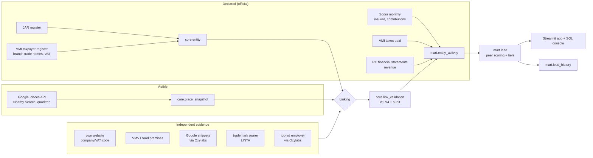

# shadowleads: busy in public, quiet on paper

A monthly pipeline that gives a VMI (State Tax Inspectorate) analyst a **prioritised, explainable
lead list** of Vilnius businesses that look busy on Google but declare little to the state. It
covers three categories: **hairdressers & beauty salons**, **bars, pubs & night clubs**, and
**car wash & repair**.

> Leads, not accusations. Every lead shows which Google listing and which official records it is
> built from, how the two were linked, how sure we are of that link, and why it scored as it did.
> Honest businesses are protected by design (see [Trust](#trust-the-cost-of-a-wrong-lead)).

```bash
docker compose up        # http://localhost:8501
```
This rebuilds the warehouse from the committed, pseudonymised example (`examples/2026-09`) and
serves the analyst app. It needs no keys and makes no calls to data sources. A live monthly run is
opt-in, because it spends API quota: `SHADOWLEADS_MODE=live docker compose up`, with keys in `.env`
(see [.env.example](.env.example)).

## Results of the committed run (September 2026 snapshot)

| | Hair & beauty | Bars & clubs | Car wash & repair |
|---|---|---|---|
| Google places in scope | 1,668 | 361 | 1,348 |
| Linked to a legal entity | 16% | 49% | 42% |
| ... share of all Google reviews covered | 38% | 61% | 67% |
| Priority A / watchlist leads | 7 / 8 | 0 / 5 | 2 / 12 |

- 4,017 places swept, 1,005 linked, of which 775 links are trusted enough to feed Priority A.
- Manual audit of 48 stratified links: 75% were correct before the audit-driven fixes. Of the 12 wrong
  links, 3 are no longer produced by the rules, 3 are corrected by analyst overrides, and 5 of the
  other 6 were already kept out of Priority A by the trust rules.
- Independent evidence agrees with name-based links in 93% of the cases where both exist; for
  address-only links the figure is 64%, so those never feed Priority A unless confirmed.
- External calls: 1,115 Google calls (within the free tier in each month), 450 Oxylabs results, and
  about 900 polite requests to public registers.

## How it works



### Data sources

| Source | What we take | Grain | Freshness |
|---|---|---|---|
| Google Places API (New), Nearby Search | name, address, coordinates, primary type, rating, **review count**, opening hours, price range, website | place × month | live |
| Registrų centras JAR (bulk CSV) | company code, legal name, legal form, registered address, status | entity | daily |
| VMI taxpayer register (data.gov.lt) | **branch trade names** in Vilnius, activity codes, VAT registration | entity × branch | daily |
| VMI taxes paid (data.gov.lt) | taxes paid per calendar year (current year to date) | entity × year | monthly |
| Sodra (atvira.sodra.lt bulk ZIP) | insured persons, contributions, average wage, activity code | entity × month | monthly, ~1 month lag |
| RC financial statements (data.gov.lt) | sales revenue, labelled with its fiscal year | entity × FY | lags (FY2024 mostly) |
| VMVT food-business register | company code + trade name + **premises address** (bars) | premises | live |
| Businesses' own websites | self-declared company / VAT code (robots.txt honoured) | place | live |
| Oxylabs Web Scraper API (Google Search) | company codes and job-ad employers quoted in search snippets | place | live |
| State Patent Bureau (search.linta.lt) | trademark owner of the brand | brand | live |

Rejected sources: rekvizitai.lt and LIS licence pages (terms forbid copying), .lt WHOIS (the
registrant is hidden), Google Popular Times (relative to each venue's own peak, so it doesn't show
visitor volume, and it has no official API).

### Linking a Google place to a company code
1. **Exact full name** against JAR legal names and VMI branch trade names. Google "Bromas Baras"
   matches VMI branch "Bromas". This needs corroboration: an activity code that fits the category, or
   the same building as the registered address (flats are ignored, so "60A-245" matches "60A").
2. **Core name** (generic words like "baras" or "kirpykla" removed): only with address agreement,
   or a rare name plus an activity code that fits.
3. **Address only**: exactly one consistent company registered at a non-multi-tenant Vilnius
   address.
4. **Fallbacks** for everything else: codes on the business's own website, VMVT premises,
   directory URLs, search snippets, trademark owners, job-ad employers.

Every candidate, its evidence and the decision are stored (`core.match_candidate`,
`core.place_entity_link`), versioned per month.

**Validation** (`core.link_validation`):
- **V1:** plausibility checks.
- **V2:** agreement with independent evidence.
- **V3:** manual audit labels (`labels/match_audit.csv`, created by `shadowleads audit-sample`).
- **V4:** analyst overrides (`labels/link_overrides.csv`), re-applied every month.

Trademark and job-ad evidence identify the company behind a *brand*. For franchises (Švaros broliai)
and groups that run one company per venue (Grill London), that is not the operator, so these sources
never confirm a link on their own.

### Scoring: "declares far less than peers who look equally busy"
- **Visible activity:** Google reviews per active year, summed over the company's Vilnius places.
  A company is "busy" if it is at or above the category's 75th percentile of *all* Google places.
  Very low or very high ratings must reach the 90th percentile: they attract disproportionate
  reviews, so they need more evidence rather than adjusted counts.
- **Peers:** same category × review-volume quintile × legal form (MB/IĮ owners pay part of their
  taxes personally). Medians come from single-site, activity-consistent peers only, so national
  chains don't inflate them.
- **Score:** weighted `ln(peer median / declared)` gaps:
  - VMI taxes paid (0.5, the main dimension);
  - Sodra contributions, or headcount when Sodra suppresses contributions (0.3);
  - latest filed revenue, with its fiscal year shown (0.2).
- **Secondary ratios:** reviews per €1k of taxes and per €1k of revenue, and insured persons per 100
  reviews. Near-zero values are clamped to a floor so the ratios can't explode.
- **Corroborating signals:**
  - near-zero declared figures;
  - opening hours that need more staff than declared;
  - no VAT registration while peers turn over more than €45k.

### Trust: the cost of a wrong lead
Priority A is capped at 20 per month (the analyst's capacity) and requires *all* of:
- a usable link;
- a visibly busy business;
- peers paying at least 3× more tax;
- an entity at least 12 months old, with a VMI record (missing data is never treated as zero);
- no other company at the same premises;
- no sign that the reviews predate the operator;
- at least one corroborating signal (two if the rating is extreme).

Every other entity gets a tier and a stated `hold_reason`. Each lead also shows the legitimate
explanations typical of its category (chair rental, family labour, group staffing). 18 data-quality
assertions run on every run, and an `error` blocks the export.

## Using it

**Analyst app** (`docker compose up` → http://localhost:8501):
- **Leads:** filter by tier and category, download CSV. Each lead opens a plain-language
  explanation, its Google listings, the official records (VMI per year, Sodra per month, revenue),
  the link evidence, the score components and the source lineage (URL, time, sha256).
- **Coverage & map**, **Month-over-month**, **Data quality**.
- **SQL console:** read-only SQL over the warehouse, with saved example questions:
  ```sql
  -- which categories have the highest share of flagged businesses?
  SELECT main_category, count(*) AS scored,
         count(*) FILTER (WHERE tier IN ('A_priority','B_watchlist')) AS flagged,
         round(100.0 * flagged / scored, 1) AS pct_flagged
  FROM mart.lead WHERE tier <> 'D_insufficient_evidence' GROUP BY ALL ORDER BY pct_flagged DESC;
  ```
  The DuckDB file (`data/warehouse.duckdb`) also opens in any SQL client.

**Monthly operation:**
- `shadowleads run --run-month 2026-10` runs the whole chain:
  1. ingest
  2. link
  3. fallbacks
  4. validate
  5. score
  6. DQ checks
  7. export
- Each stage is idempotent per run month and can be run on its own (`shadowleads --help`).
- Months accumulate in the same warehouse. `mart.lead_history` shows new, persisting and resolved
  leads and why each changed: re-linked, declared figures changed, or visible activity changed.
- Every Google and Oxylabs response is cached, and a call ledger enforces monthly budgets
  (`SHADOWLEADS_GOOGLE_BUDGET`, default 900).

**Local development:**
```bash
uv sync
uv run ruff check . && uv run pyrefly check && uv run pytest
uv run shadowleads run          # needs GOOGLE_MAPS_API_KEY (+ OXYLABS_* optional) in .env
uv run streamlit run app/streamlit_app.py
```

**Public example:** `examples/<month>/` is pseudonymised:
- names, codes and place ids are replaced with keyed HMAC pseudonyms (fake codes start with 9);
- review counts and money are bucketed, ratings rounded to 0.5, coordinates coarsened to ~1 km;
- per-entity official time series are kept only for one negative control (a large business that
  was not flagged).

Real names appear only in local runs (`output/`, gitignored).

## Repository layout
```
src/shadowleads/
  sources/   google_places, official (JAR/Sodra/VMI/RC), vmvt, websites, oxylabs, trademarks, spinta
  linking/   normalize, matcher (primary rules), fallback, brand_evidence, resolve
  sql/       core_*, mart_*, dq_checks.sql  (stg -> core -> mart)
  cli.py     stages + `run` / `auto` / `demo`
app/         Streamlit analyst app
examples/    pseudonymised real run (Parquet + leads.csv)
labels/      analyst audit labels and link overrides (inputs)
tests/       Hypothesis property tests, parser/rule regressions, app smoke tests
```

## Towards production

**Scalability (3 categories in Vilnius → every business in Lithuania)**
- Bulk registers already cover the whole country, so only Google is bounded by area.
- Tile Lithuania by municipality with the same density-aware quadtree: about 60 times Vilnius,
  roughly 40–70k calls/month at full refresh.
- Refresh incrementally instead: re-query only cells whose last result was saturated or changed,
  and refresh known `place_id`s via Place Details on a rotating schedule.
- Swap DuckDB for Postgres or a lakehouse (Iceberg + DuckDB/Trino) with an orchestrator (Dagster)
  once several analysts and services need to write. The SQL models port as-is (dbt/SQLMesh).

**Accuracy (matching and scoring)**
- Turn audit labels into a trained matcher (Fellegi-Sunter or gradient boosting over the stored
  candidate features).
- Add data VMI already holds but that isn't public: i.EKA cash-register receipts, i.SAF invoices,
  employment contracts per premises, and the premises register of business-licence holders.
  Linking then becomes exact and the visible-activity proxy can be calibrated against true turnover.
- Calibrate visible activity per category with inspection outcomes (dispositions feed back as
  labels).
- Monitor review fraud: review bursts and rating distribution.

**Freshness (sources change at different rates)**
- JAR and the VMI register: daily diffs.
- Sodra and VMI taxes: monthly, after publication.
- Financial statements: when filed.
- Google: monthly snapshot for review velocity; place details more often for venues on the
  watchlist.
- Snapshot deltas (reviews/month) replace the lifetime-average estimate once 3+ months exist.

**Monitoring & data quality**
- The DQ suite (`meta.dq_result`) plus row-count and freshness SLOs per source.
- Schema-drift detection: the Sodra 2026 file added a column, and the loader reads headers to
  survive that.
- Link-drift alerts (`relinked_since_last_run`), score-distribution drift per category, budget and
  quota alerts.
- Structured JSON logs (structlog) shipped to the existing observability stack.

**Cost**
- Bulk downloads over per-entity APIs; Google responses cached on disk by request hash.
- Distance-ranked k×k quadtree (saturated cells are split by estimated density, and children
  already covered are skipped).
- Paid search (Oxylabs) only for unresolved busy places and validation samples.
- At national scale the main cost is Google Places, so a commercial licence or official data-sharing
  agreement is needed anyway (see the terms note in DECISIONS.md).

See [DECISIONS.md](DECISIONS.md) for design decisions, rejected alternatives and known limitations.
